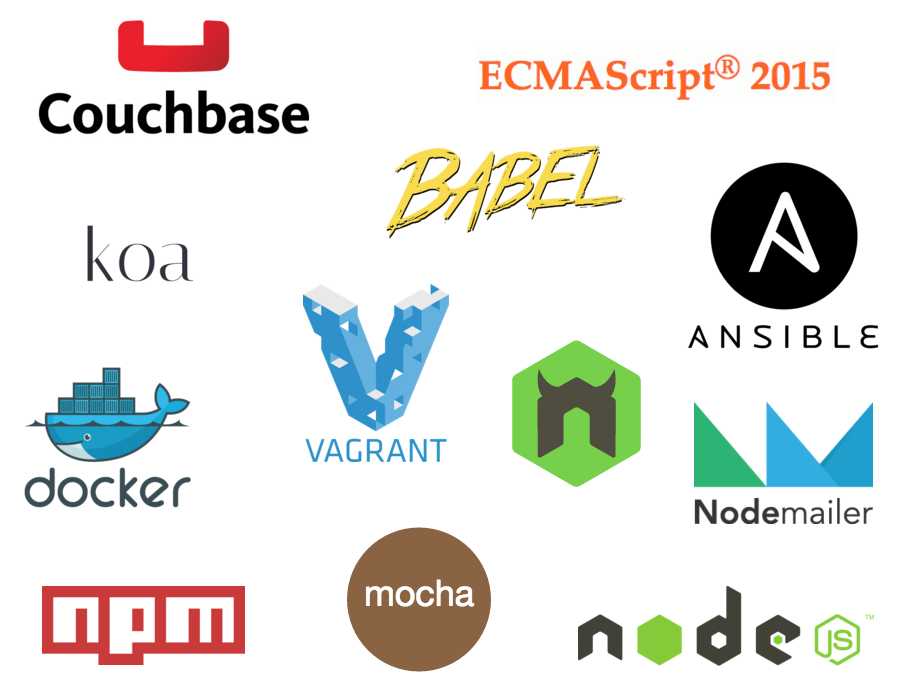

Employee Scheduling API
=======================

[](https://gitter.im/martinmicunda/employee-scheduling-api?utm_source=badge&utm_medium=badge&utm_campaign=pr-badge&utm_content=badge)
[](http://travis-ci.org/martinmicunda/employee-scheduling-api)
[](https://ci.appveyor.com/project/martinmicunda/employee-scheduling-api/branch/master)
[](https://david-dm.org/martinmicunda/employee-scheduling-api#info=dependencies) 
[](https://david-dm.org/martinmicunda/employee-scheduling-api#info=devDependencies) 
[](https://coveralls.io/github/martinmicunda/employee-scheduling-api?branch=master)
[](https://codeclimate.com/github/martinmicunda/employee-scheduling-api)
[](http://www.gnu.org/licenses/gpl-3.0.html)

An API component for [Employee Scheduling](https://github.com/martinmicunda/employee-scheduling) application that makes employee scheduling and management easy, fast and mobile. The UI component for this application can be found [here](https://github.com/martinmicunda/employee-scheduling-ui). I wrote a few blog posts about this project and they can be found on my [blog](http://martinmicunda.com).

## Table of Contents
- [Technologies Used](#technologies-used)
- [Features](#features)
- [Installation & Configuration](#installation-and-configuration)
    - [Platform & Tools](#platform-and-tools)
    - [Installation](#installation)
- [How to Run](#how-to-run)
- [How to Test](#how-to-test)
- [How to Release](#how-to-release)
- [FAQ](#faq)
- [License](#license)

## Technologies Used


## Features
  * Use ES6/ES7
  * [Couchbase Database](http://www.couchbase.com/) (a highly scalable distributed KV-Store and Document Database) with [N1QL](http://developer.couchbase.com/guides-and-references) queries
  * Internationalization and localization with [i18n-node-2](https://github.com/jeresig/i18n-node-2)
  * Transactional emails with [Nodemailer](http://nodemailer.com) and [SendGrid](https://sendgrid.com)
  * JSON Web Token ([JWT](http://jwt.io)) authentication

##<a name="installation-and-configuration"></a>Installation & Configuration
###<a name="platform-and-tools"></a>Platform & Tools
You need to have installed follow tools on your machine:

- [Virtualbox](https://www.virtualbox.org/wiki/Downloads) 5.0.6+
- [Vagrant](http://www.vagrantup.com/downloads.html) 1.7.4+
- [Ansible](http://docs.ansible.com/intro_installation.html) 1.9.4+
- [Node.js](https://nodejs.org/en/download/) 4.2.2+
- [npm](https://www.npmjs.com/) 2.0.0+

###<a name="installation"></a>Installation
The steps 3 and 8 are only required when you don't have local instance of Couchbase Server 4.0 configured. If you've already configured a local instance of Couchbase Server 4.0 or newer, the application can use this instance as long as you specify the credentials to connect to Couchbase within the application [config.js](https://github.com/martinmicunda/employee-scheduling-api/blob/master/lib%2Fconfig%2Fconfig.js) file.

**1.** Clone or [fork](https://github.com/martinmicunda/employee-scheduling-api/fork) this repository:
```bash
$ git clone git@github.com:martinmicunda/employee-scheduling-api.git 
$ cd employee-scheduling-api
```

**2.** Install local dependencies
```bash
$ npm install
```
     
**3.** The following command will add a new `ubuntu trusty64 box`, and if an existing one is found, it will override it:

```bash
$ vagrant box add ubuntu/trusty64 --force
```
>**NOTE:** This process may take a while, as most Vagrant boxes will be at least **200 MB** big.

Verify that box was installed by running the `list` subcommand that will list the boxes installed within Vagrant along with the provider that backs the box:

```bash
$ vagrant box list
ubuntu/trusty64  (virtualbox, 14.04)
```

**4.** The following command will install an `ansible roles` for this project, and if an existing one is found, it will override it:

```bash
$ ansible-galaxy install franklinkim.docker franklinkim.docker-compose moviedo.nvm --force
```
Verify that ansible roles were installed by running the `list` subcommand that will list the installed roles:

```bash
$ ansible-galaxy list
franklinkim.docker, 1.5.0
franklinkim.docker-compose, 1.1.0
moviedo.nvm, v1.1.1
```

**5.** Now, run `vagrant up` command that will install `Docker`, `Docker Compose`, `NVM` inside of vagrant box: 

```bash
$ vagrant up
```
>**NOTE:** **Vagrant will provision the virtual machine only once on the first run, any subsequent provisioning must be executed with the** `--provision` **flag either** `vagrant up --provision` **or** `vagrant reload --provision` **. The provisioning will re-run also if you destroy the VM and rebuild it with** `vagrant destroy` **and** `vagrant up` **.**

**6.** Once the box is up and running we can ssh into box: 

```bash
$ vagrant ssh
```
 and run Couchbase Server:
 
```bash
$ cd api
$ docker-compose up db
```

>**NOTE:** This process may take a while, when you run this command for the first time as it pull couchbase docker image from docker repository.

**7.**  As we are running the Couchbase Server for the first time we need to make sure the server is configured properly before we start any development. The below command will provision Couchbase Server instance:

```bash
$ npm run setup
```

**8.**  Now when we provisioned Couchbase Server instance we can seed this instance with an application data:

```bash
$ npm run seed
```

Finally, open up your browser and navigate to Couchbase admin UI [http://localhost:8091](http://localhost:8091/) with username: `Administrator` and password: `password`. 

##<a name="how-to-run"></a>How to Run

Start the couchbase:

```bash
$ vagrant up && vagrant ssh
$ cd api
$ docker-compose up db
```

Start the server:

```bash
$ npm start
```

>**NOTE:** The [dotenv](https://github.com/motdotla/dotenv) is use as an environment variable manager that loads environment variables from `.env` into `ENV` (process.env).

Start the server with [nodemon](http://nodemon.io/):

```bash
$ npm run dev
```

From time to time you might want to reset and seed data; to achieve this you can run a follow command:

```bash
$ npm run seed
```

##<a name="how-to-test"></a>How to Test
TODO

##<a name="how-to-test"></a>How to Release
TODO

## FAQ
### What if I want to uninstall application?
**1.** The following command would permanently removes the `default` virtual box from your machine:
```bash
$ vagrant destroy
```
**2.** The following command will uninstall an `ansible roles` for this project:
```bash
$ ansible-galaxy uninstall franklinkim.docker franklinkim.docker-compose moviedo.nvm
```

**3.** The following command will remove  `trusty64 box`:
```bash
$ vagrant box remove trusty64
```
###What if I want a fresh install?
If you wish to destroy the `default` virtual boxe to make sure you have a fresh start, you can do these steps:
```bash
 $ vagrant destroy 
 $ vagrant up
```

## License

    Copyright (c) 2014-2015 Martin Micunda  

    Source code is open source and released under the GNU GPL v3 license.
